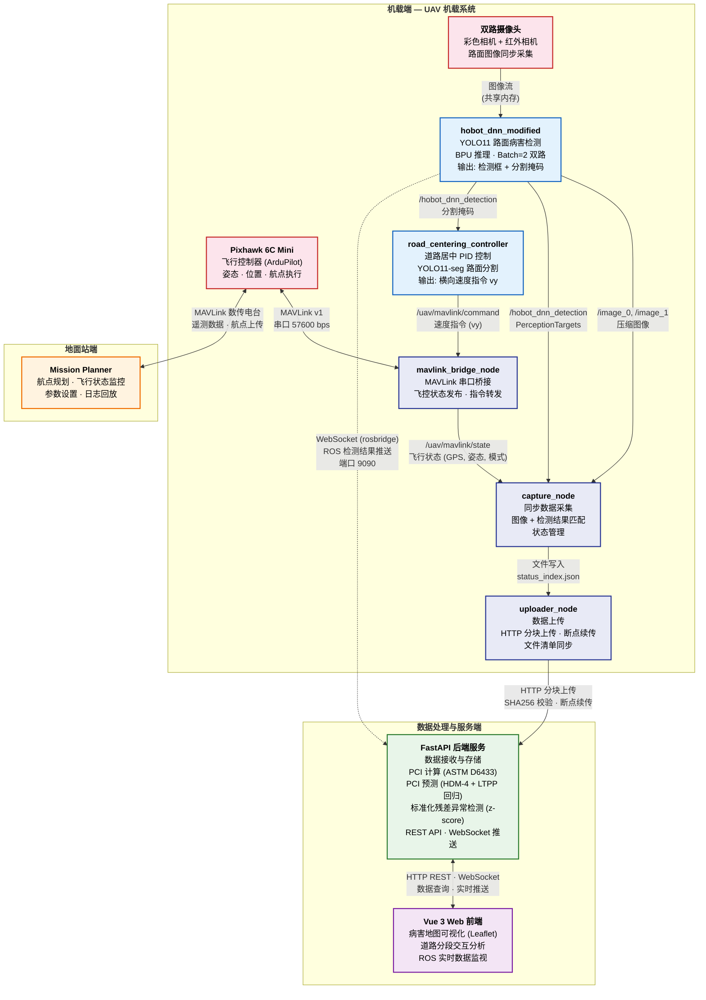

# UAV 道路巡检系统框架图

## 图例说明

| 线条样式 | 含义 |
|----------|------|
| 实线箭头 `-->` | 单向数据流 |
| 实线双向 `<-->` | 双向通信 |
| 虚线双向 `<-.-.->` | 跨网络桥接 (WebSocket 隧道) |

| 颜色 | 所属层级 | 说明 |
|------|----------|------|
| 红色边框 | 机载端 — 硬件 | 飞控、摄像头等物理设备 |
| 蓝色边框 | 机载端 — 算法 | DNN 推理、PID 控制等计算模块 |
| 深蓝边框 | 机载端 — 任务管理 | 数据采集、上传、MAVLink 桥接 |
| 橙色边框 | 地面站端 | Mission Planner |
| 绿色边框 | 服务端 | FastAPI 后端服务 |
| 紫色边框 | 前端 | Vue 3 Web 界面 |

## 通信协议汇总

| 协议 | 通信对象 | 用途 |
|------|----------|------|
| **MAVLink v2** (串口) | Pixhawk ↔ mavlink_bridge_node | 飞控遥测与指令 |
| **MAVLink** (数传电台) | Pixhawk ↔ Mission Planner | 航点上传、飞行监控 |
| **ROS2 Topic** (DDS) | RDK X5 内部节点 | 图像、检测结果、飞行状态、控制指令 |
| **HTTP REST** | uploader_node → FastAPI 后端 | 数据分块上传、文件清单同步 |
| **WebSocket** (rosbridge) | FastAPI 后端 ↔ RDK X5 | ROS 话题跨网络桥接 |
| **HTTP / WebSocket** | 前端 ↔ FastAPI 后端 | 数据查询、实时推送 |
